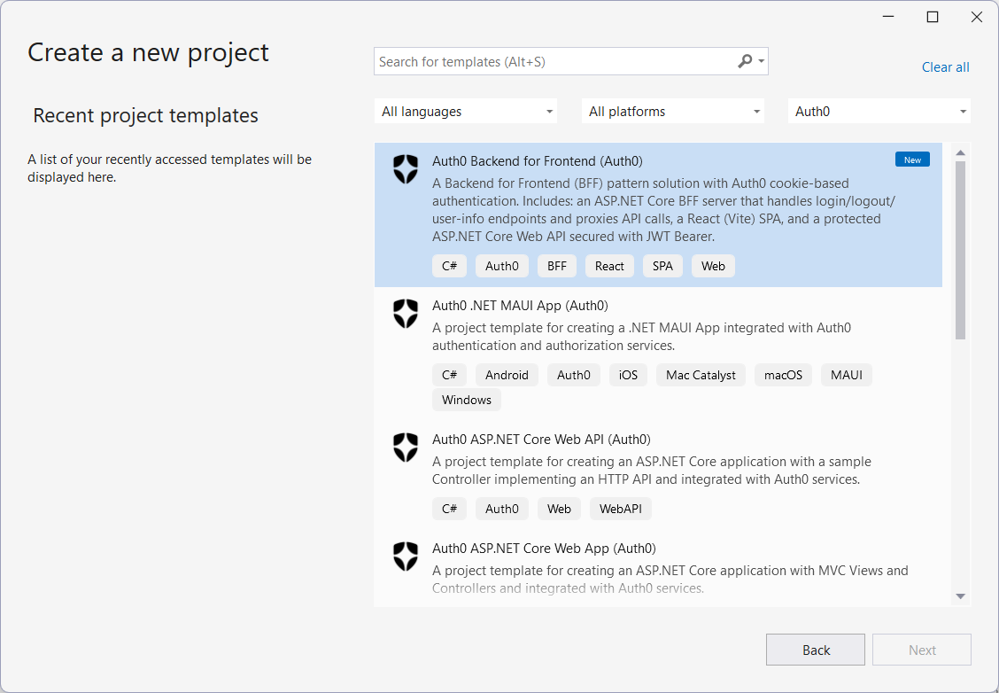
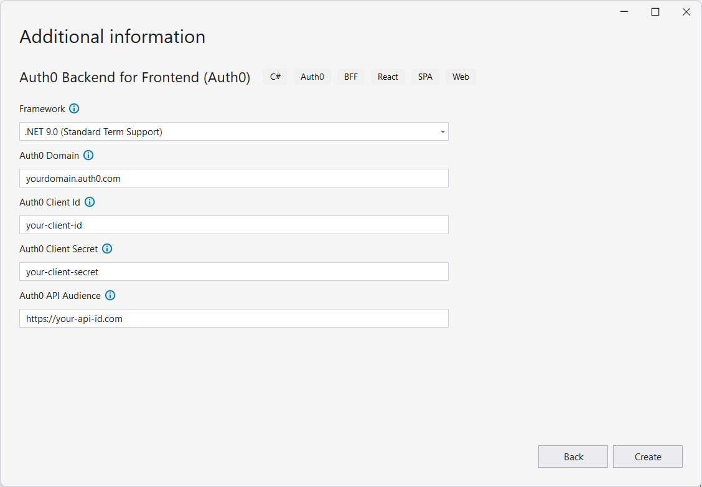

## Auth0 Backend for Frontend Application

The [Backend for Frontend (BFF) pattern](https://auth0.com/blog/the-backend-for-frontend-pattern-bff/) is an approach to securing Single Page Applications (SPAs) where a server-side component handles authentication on behalf of the frontend. This template creates a full-stack solution that includes:

- An **ASP.NET Core BFF server** that manages login, logout, and user-info endpoints, and proxies authenticated API calls using cookie-based authentication.
- A **React (Vite) SPA** that delegates authentication entirely to the BFF server.
- A **protected ASP.NET Core Web API** secured with JWT Bearer tokens, accessible only through the BFF server.

For more information about the implementation of the BFF pattern with ASP.NET Core and Auth0, check out the [Backend For Frontend Authentication Pattern with Auth0 and ASP.NET Core](https://auth0.com/blog/backend-for-frontend-pattern-with-auth0-and-dotnet/) article.

#### Using the .NET CLI

To create a new Backend for Frontend solution, you can run the following command:

```
dotnet new auth0bff [options]
```

This will create a new BFF solution with Auth0 support in the current folder.

##### Automatic registration

If you have the [Auth0 CLI](https://github.com/auth0/auth0-cli) installed on your machine and [logged in to Auth0](https://github.com/auth0/auth0-cli?tab=readme-ov-file#authenticating-to-your-tenant), you can run the template command without any options and it will automatically register and configure your application with Auth0.

Example:

```shell
dotnet new auth0bff -o MyBffApp
```

The template engine will ask for confirmation to perform the registration action:

```shell
The template "Auth0 Backend for Frontend" was created successfully.

Processing post-creation actions...

Template is configured to run the following action:
Actual command: register-with-auth0.cmd 
Do you want to run this action [Y(yes)|N(no)]?
```

Once you confirm, you will get an entry for the application **in your current Auth0 tenant** and your application will be configured accordingly.

##### Manual registration

In addition to the usual options for the `dotnet new` command, the following template-specific options are available:

- `--domain`<br>
  The Auth0 domain associated with your tenant. The default value is `yourdomain.auth0.com`.
- `--client-id`<br>
  The client id associated with your application. The default value is `your-client-id`.
- `--client-secret`<br>
  The client secret associated with your application. The default value is `your-client-secret`.
- `--audience`<br>
  The API identifier (audience) as defined in your Auth0 dashboard. The default value is `https://your-api-id.com`.
- `-f` or `--framework`<br>
  Defines the target framework to use for the ASP.NET Core projects. The possible values are `net9.0` and `net10.0`. The default value is `net10.0`.

Example:

```shell
dotnet new auth0bff -o MyBffApp --domain myapp.auth0.com --client-id uw63N1fx43yQUwD7Xp4eq9BjKhPeW0dK --client-secret myClientSecret --audience https://myapi.com
```

#### Using Visual Studio for Windows

To create a new Backend for Frontend solution with Visual Studio for Windows, select *Auth0* from the project types dropdown list and then *Auth0 Backend for Frontend*:



Then, after inserting the name and the folder for the solution, provide the required options:




##### Automatic registration

Unfortunately, Visual Studio and Rider do not support template's post actions (see [this issue](https://github.com/dotnet/templating/issues/4575) and [this one](https://github.com/dotnet/templating/issues/3226)) so your application will not be automatically registered as it happens with .NET CLI. However, you can run the post action manually to get your application configured.

To launch the automatic registration process, go to the folder of the newly created solution and run the following command:

```shell
./register-with-auth0.cmd
```

> Note: on MacOS you need to enable the script to execute. Run the following command before launching the automatic registration:
>
> ```shell
> chmod +x register-with-auth0.cmd
> ```


---

[Back to README](../README.md)
