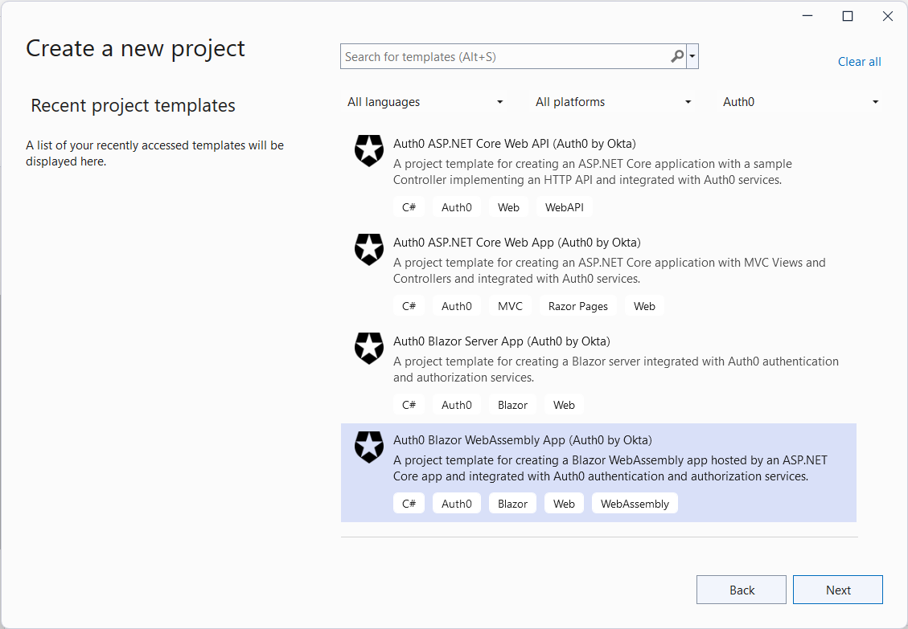
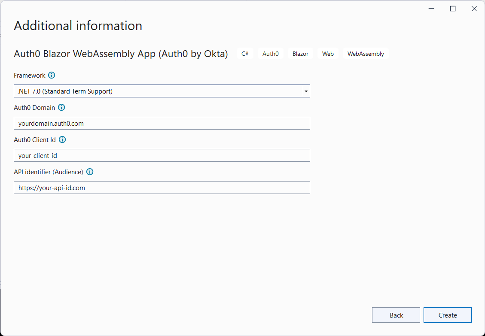

## Auth0 Blazor WebAssembly Application

For more information about creating and securing a Blazor WebAssembly application with Auth0, check out the [Auth0 Blazor WebAssembly Tutorial](https://auth0.com/blog/securing-blazor-webassembly-apps/).

#### Using the .NET CLI

To create a new Blazor WebAssembly ([ASP.NET Core hosted](https://docs.microsoft.com/en-us/aspnet/core/blazor/hosting-models)) application with the .NET CLI, you can run the following command:

```
dotnet new auth0blazorwasm [options]
```

This will create a new Blazor WebAssembly application in the current folder. The following template-specific options are available:

- `--domain`<br>
  The Auth0 domain associated with your tenant. The default value is `yourdomain.auth0.com`.
- `--client-id`<br>
  The client id associated with your application. The default value is `your-client-id`.
- `--audience`<br>
  The API identifier (audience) as defined in your Auth0 dashboard. The default value is `https://your-api-id.com`.
- `-f` or `--framework`<br>
  Defines the target framework to use for the .NET project. Currently, the only possible value is `net7.0`, which is also the default value.


#### Using Visual Studio for Windows

To create a new Blazor WebAssembly application with Visual Studio, select *Auth0* from the project types dropdown list and then *Auth0 Blazor WebAssembly App*:



Then, after inserting the name and the folder for the project, provide the required options:



---

[Back to README](../README.md)

