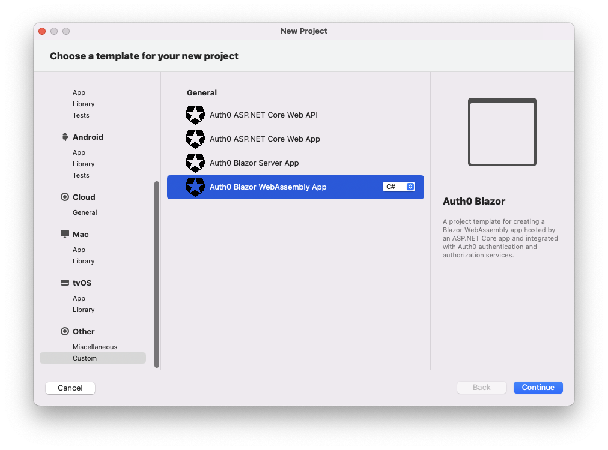
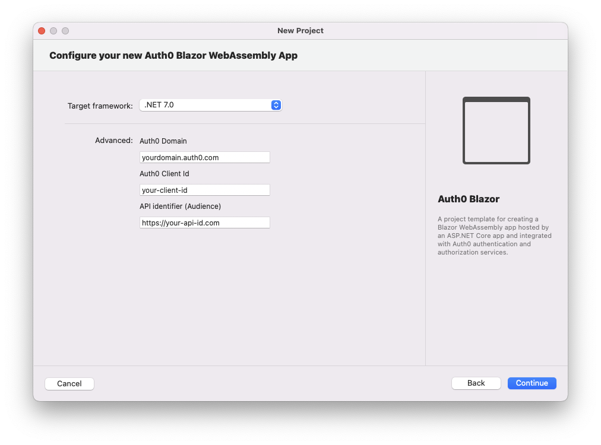

## Auth0 Blazor WebAssembly Application

For more information about creating and securing a Blazor WebAssembly application with Auth0, check out the [Auth0 Blazor WebAssembly Tutorial](https://auth0.com/blog/securing-blazor-webassembly-apps/).

#### Using the .NET CLI

To create a new Blazor WebAssembly ([ASP.NET Core hosted](https://docs.microsoft.com/en-us/aspnet/core/blazor/hosting-models)) application with the .NET CLI, you can run the following command:

```
dotnet new auth0blazorwasm [options]
```

This will create a new Blazor WebAssembly application with Auth0 authentication in the current folder.

##### Automatic registration

If you have the [Auth0 CLI](https://github.com/auth0/auth0-cli) installed on your machine and logged in to Auth0, you can run the template command without any options and it will automatically register and configure your application with Auth0.

Example:

```shell
dotnet new auth0blazorwasm -o MyBlazorWasm
```

The template engine will ask for confirmation to perform the registration action:

```shell
The template "Auth0 Blazor WebAssembly App" was created successfully.

Processing post-creation actions...

Template is configured to run the following action:
Actual command: register-with-auth0.cmd 
Do you want to run this action [Y(yes)|N(no)]?
```

Once you confirm, you will get an entry for the application in your current Auth0 tenant and your application will be configured accordingly.

##### Manual registration

In addition to the usual options for the `dotnet new` command, the following template-specific options are available:

- `--domain`<br>
  The Auth0 domain associated with your tenant. The default value is `yourdomain.auth0.com`.
- `--client-id`<br>
  The client id associated with your application. The default value is `your-client-id`.
- `--audience`<br>
  The API identifier (audience) as defined in your Auth0 dashboard. The default value is `https://your-api-id.com`.
- `-f` or `--framework`<br>
  Defines the target framework to use for the .NET project. Currently, the only possible value is `net7.0`, which is also the default value.

Example:

```shell
dotnet new auth0blazorwasm -o MyBlazorWasm --domain myapp.auth0.com --client-id uw63N1fx43yQUwD7Xp4eq9BjKhPeW0dK --audience https://myapi.com
```

#### Using Visual Studio for Windows

To create a new Blazor WebAssembly application with Visual Studio for Windows, select *Auth0* from the project types dropdown list and then *Auth0 Blazor WebAssembly App*:


Then, after inserting the name and the folder for the project, provide the required options:


#### Using Visual Studio for Mac

To create a new Blazor WebAssembly application with Visual Studio for Mac, select *Custom* from the *Other* project types list and then *Auth0 Blazor WebAssembly App*:



Then, after inserting the name and the folder for the project, provide the required options:



##### Automatic registration

Unfortunately, Visual Studio does not support template's post actions (see [this issue](https://github.com/dotnet/templating/issues/4575) and [this one](https://github.com/dotnet/templating/issues/3226)) so your application will not be automatically registered as it happens with .NET CLI. However, you can run the post action manually to get your application configured.

To launch the automatic registration process, go to the folder of the newly created application and run the following command:

```shell
./register-with-auth0.cmd
```

> Note: on MacOS you need to enable the script to execute. Run the following command before launching the automatic registration:
>
> ```shell
> chmod +x register-with-auth0.cmd
> ```

---

[Back to README](../README.md)

