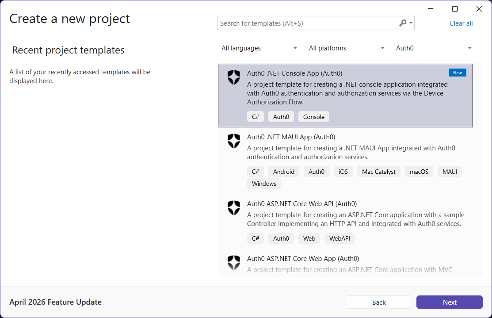
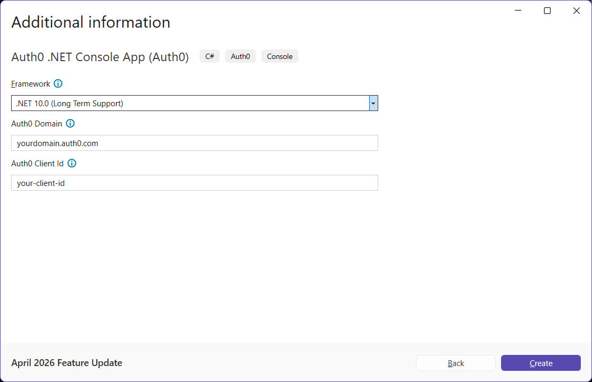
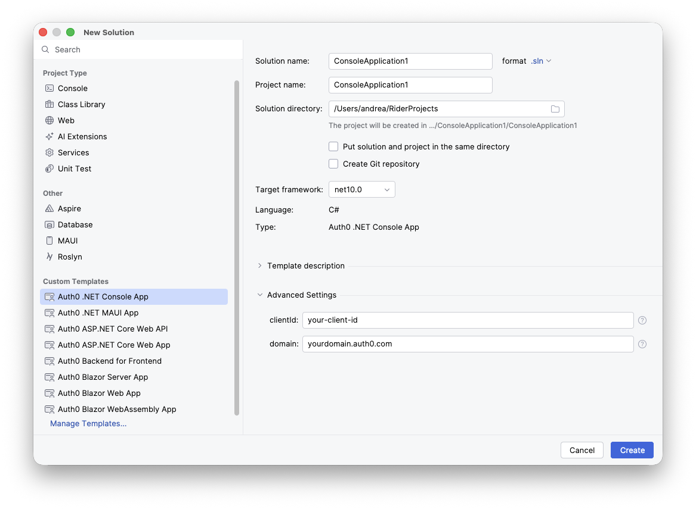

## Auth0 .NET Console Application

The `auth0console` template scaffolds a .NET console application that authenticates users with Auth0 using the [Device Authorization Flow](https://auth0.com/docs/get-started/authentication-and-authorization-flow/device-authorization-flow). It is ideal for input-constrained or headless devices, CLIs, and any scenario where a full browser-based redirect is not practical.

For more information about the Device Authorization Flow, check out the [Call Your API Using the Device Authorization Flow](https://auth0.com/docs/get-started/authentication-and-authorization-flow/device-authorization-flow/call-your-api-using-the-device-authorization-flow) documentation.

#### Using the .NET CLI

To create a new console application with the .NET CLI, you can run the following command:

```
dotnet new auth0console [options]
```

This will create a new console application with Auth0 authentication in the current folder.

##### Automatic registration

If you have the [Auth0 CLI](https://github.com/auth0/auth0-cli) installed on your machine and [logged in to Auth0](https://github.com/auth0/auth0-cli?tab=readme-ov-file#authenticating-to-your-tenant), you can run the template command without any options and it will automatically register and configure your application with Auth0.

Example:

```shell
dotnet new auth0console -o MyConsoleApp
```

The template engine will ask for confirmation to perform the registration action:

```shell
The template "Auth0 .NET Console App" was created successfully.

Processing post-creation actions...

Template is configured to run the following action:
Actual command: register-with-auth0.cmd 
Do you want to run this action [Y(yes)|N(no)]?
```

Once you confirm, you will get an entry for the application **in your current Auth0 tenant** as a *Native* application, and your console project will be configured accordingly.

##### Manual registration

In addition to the usual options for the `dotnet new` command, the following template-specific options are available:

- `--domain`<br>
  The Auth0 domain associated with your tenant. The default value is `yourdomain.auth0.com`.
- `--client-id`<br>
  The client id associated with your application. The default value is `your-client-id`.
- `-f` or `--framework`<br>
  Defines the target framework to use for the .NET project. The only supported value is `net10.0`.

Example:

```shell
dotnet new auth0console -o MyConsoleApp --domain myapp.auth0.com --client-id uw63N1fx43yQUwD7Xp4eq9BjKhPeW0dK
```

> Note: When you register the application manually on the [Auth0 Dashboard](https://manage.auth0.com/#/applications), create a **Native** application and enable the **Device Code** grant type (Application → Advanced Settings → Grant Types).

#### Using Visual Studio for Windows

To create a new console application with Visual Studio for Windows, select *Auth0* from the project types dropdown list and then *Auth0 .NET Console App*:



After inserting the name and the folder for the project, provide the required options (Auth0 Domain and Auth0 Client Id):



#### Using JetBrains Rider

To create a new console application with JetBrains Rider, select *Auth0 .NET Console App* from the *Custom Templates* list, expand the *Advanced Settings* section, and provide the required options:



##### Automatic registration

Unfortunately, Visual Studio and Rider do not support template's post actions (see [this issue](https://github.com/dotnet/templating/issues/4575) and [this one](https://github.com/dotnet/templating/issues/3226)) so your application will not be automatically registered as it happens with .NET CLI. However, you can run the post action manually to get your application configured.

To launch the automatic registration process, go to the folder of the newly created application and run the following command:

```shell
./register-with-auth0.cmd
```

> Note: on macOS you need to enable the script to execute. Run the following command before launching the automatic registration:
>
> ```shell
> chmod +x register-with-auth0.cmd
> ```

---

[Back to README](../README.md)
