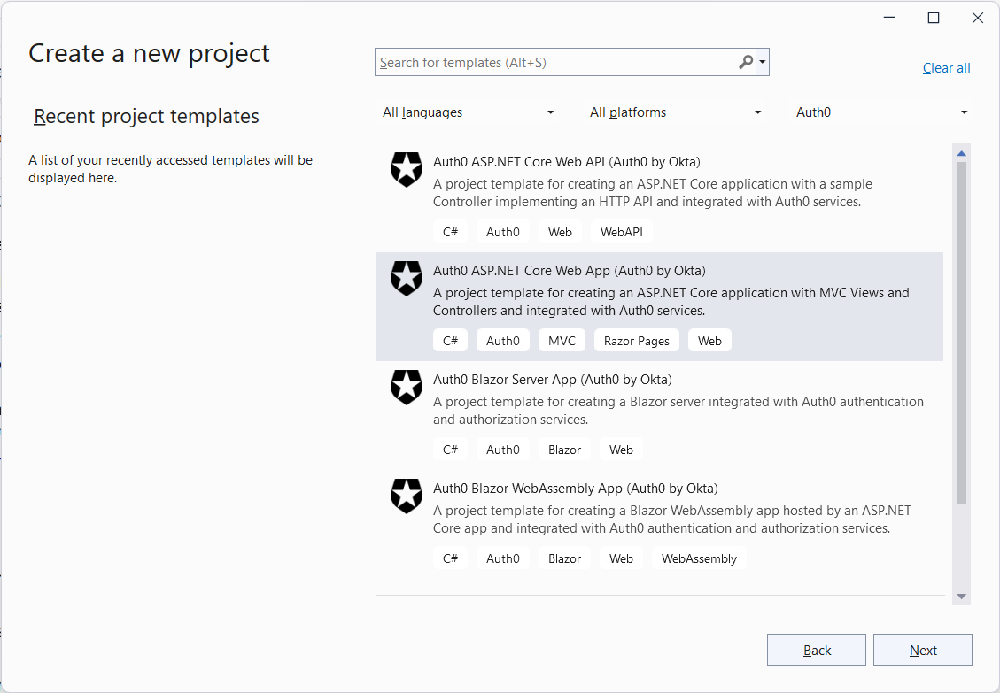
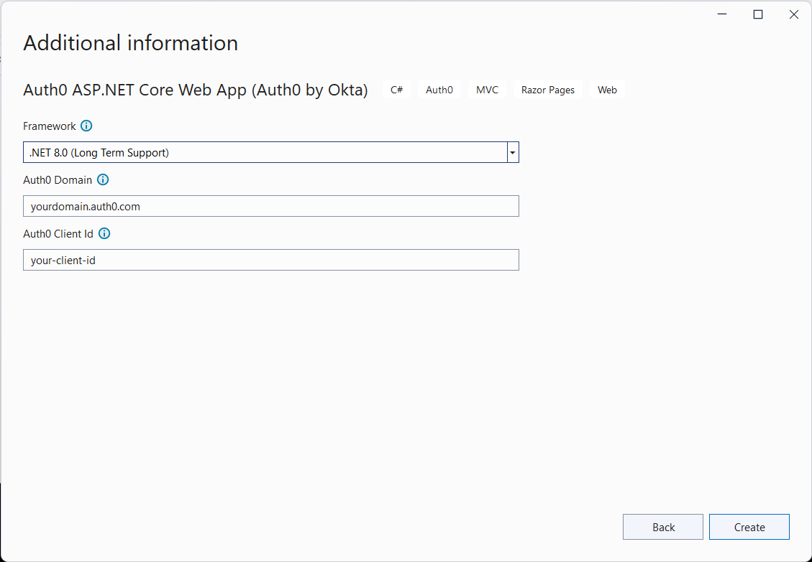
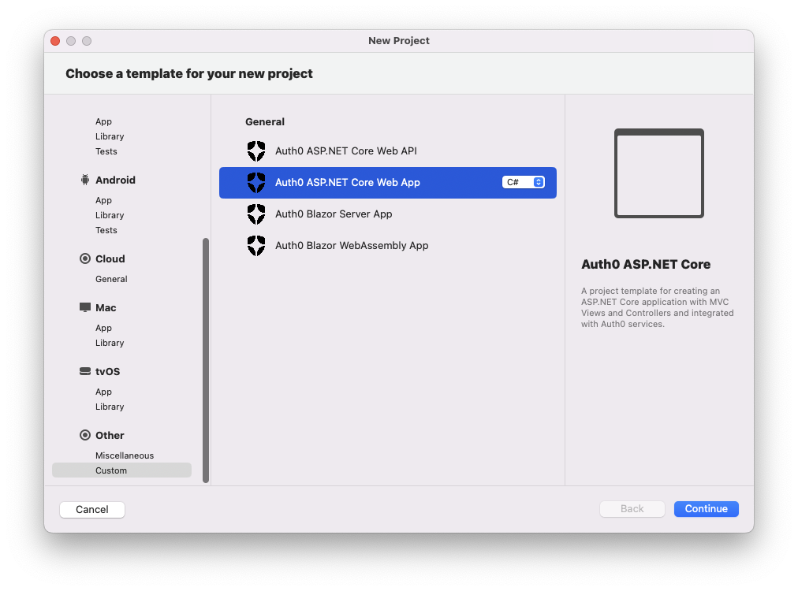

## Auth0 MVC Application

For more information about creating and securing an ASP.NET MVC application with Auth0, check out the [Auth0 ASP.NET MVC Quickstart](https://auth0.com/docs/quickstart/webapp/aspnet-core/01-login).

#### Using the .NET CLI

To create a new MVC application with the .NET CLI, you can run the following command:

```
dotnet new auth0webapp [options]
```

This will create a new MVC application with Auth0 authentication in the current folder.

##### Manual registration

In addition to the usual options for the `dotnet new` command, the following template-specific options are available:

- `--domain`<br>
  The Auth0 domain associated with your tenant. The default value is `yourdomain.auth0.com`.
- `--client-id`<br>
  The client id associated with your application. The default value is `your-client-id`.
- `-f` or `--framework`<br>
  Defines the target framework to use for the .NET project. Currently, the only possible value is `net7.0`, which is also the default value.

Example:

```shell
dotnet new auth0webapp -o MyWebApp --domain myapp.auth0.com --client-id uw63N1fx43yQUwD7Xp4eq9BjKhPeW0dK
```

##### Automatic registration

If you have the [Auth0 CLI](https://github.com/auth0/auth0-cli) installed on your machine, you can run the template command without any options and it will automatically register and configure your application with Auth0.

Example:

```shell
dotnet new auth0webapp -o MyWebApp
```

The template engine will ask for confirmation to perform the registration action.

#### Using Visual Studio for Windows

To create a new MVC application with Visual Studio for Windows, select *Auth0* from the project types dropdown list and then  *Auth0 ASP.NET Core Web App*:



Then, after inserting the name and the folder for the project, provide the required options:



#### Using Visual Studio for Mac

To create a new MVC application with Visual Studio for Mac, select *Custom* from the *Other* project types list and then  *Auth0 ASP.NET Core Web App*:



Then, after inserting the name and the folder for the project, provide the required options:


---
[Back to README](../README.md)

